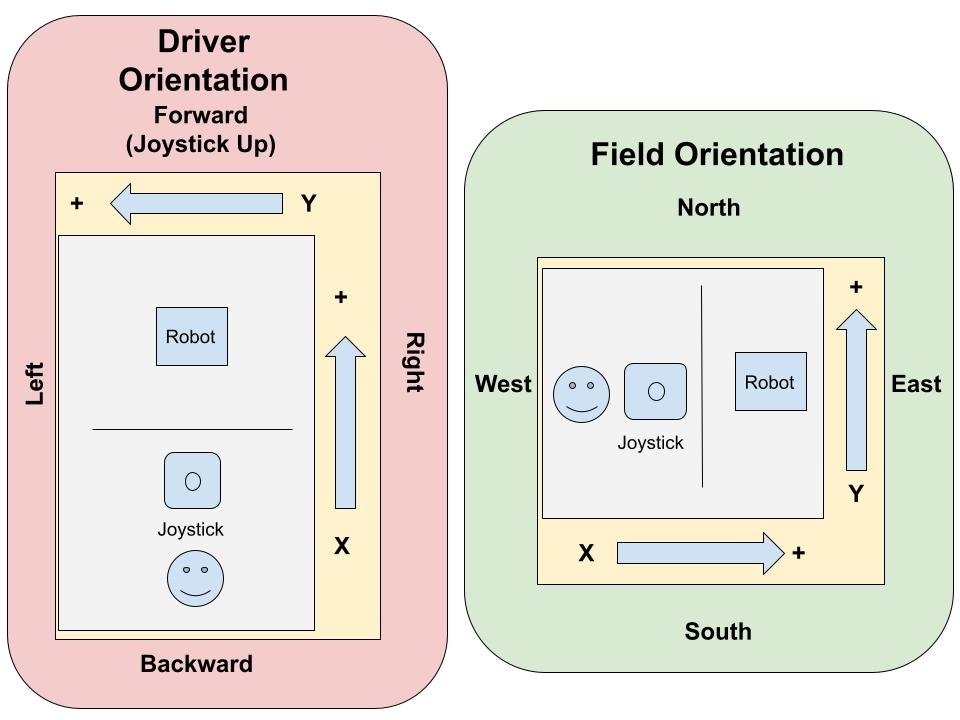

# Season Plan

The goals of the controls team (programming) are

1. to write code that allows our robot to become world champion, and
2. to have fun and learn valuable skills and knowledge.

# Controls Team
## Student Programmers

 - Gabe -- Vision Point Person
 - Jack E. -- Autos Point Person
 - Ivan -- Robot Systems Point Person
 - Ely -- Tools Point Person

## Mentors

 - Dennis (Alumni Mentor)
 - Ben (Alumni Parent Mentor)
 - John (Parent Mentor)
 - Fred (Parent Mentor)

# Controls Exams
## Core Competencies

We will use controls exams to ensure that students learn the knowledge and skills necessary to control robots. By the end of the season, every programmer will know how to do the following:

- Create a subsystem with one sensor and one actuator.
- Create a default command to run the subsystem based on operator input.
- Create an autonomous command to run the subsystem for a set duration.
- Create an autonomous command to run the subsystem until the sensor is triggered.
- Re-map joystick buttons.
- Adjust the throttle control curve.
- Assign CAN address/name.
- Recalibrate an absolute encoder.
- Adjust the limelight values.
- Adjust the direction the wheels on the drive train point and spin.
- Deploy code to the robot.

Operators and tuners will learn terminology, observe team practices, and expand their skills and knowledge so that in future seasons they can become programmers if they want.

# Robot Hardware

In years past, the team has built two robots: a practice bot and a competition bot. This year the team will build only one robot. But, we already have one robot to practice with now: the pizza bot. (Last year's robot is being disassembled for parts.) The pizza bot uses differential swerve drive (DSD) modules to rotate and translate the robot in the field. The competition bot also uses DSD modules.

We will use our practice bot to develop code to move around the field during autonomous and to give the drive team practice driving DSD robots. The drive mechanics of the competition bot will be different than the chassis bot due to differences in mass, but the team can add ballast to the chassis bot to compensate.

If the team had been unable to get DSD working reliably, the back up plan was tank drive. We are assumed there was a high likelihood that our comp bot drive mechanism would be DSD so we started with swerve drive base code.

# Project Management Tools

We have started writing code in the 2022-robot repo on GitHub at [https://github.com/frc5687/2022-robot](https://github.com/frc5687/2022-robot)

We are using GitHub for task management and issue tracking.
# Season Milestones

Mentors will define controls milestones to ensure we have a robot that works for all the students on the team. Our prime objective is to have high-quality code ready to deploy on hardware quickly enough so that the team can practice before events and compete successfully at events. Our secondary objective is to provide opportunities for student coders to learn, develop good work habits, and gain valuable management and coding experience that will help them achieve life goals.

A milestone is complete when the main branch of the code in the 2022-robot repo successfully controls a robot to achieve the milestone requirements.

See [ROADMAP](ROADMAP.md) for milestones.

# Autonomous Strategies

See [autos](autos.md).

# Notes

Point People (Students):
Control Systems (Ivan)
Auto (Jack)
Vision (Gabe)
Code Reviewers (Mentors):
Dennis
John Tower (Gabe's dad)
Vision Plan:
Limelight with targeting
Limelight with position tracking: Robust Localization will need to utilize filtering.
Jetson SLAM Localization
Jetson SLAM as Object Detection
Autonomous Plan:
Pathweaver
WPILib Trajectory
Control Algorithms:
Bang bang (start motor, stop motor)
Heuristic (ramp up / ramp down, jello, etc.)
PID control (proportional, integral, derivative)
State space (physics model)
Localization (where is our robot on the field and which direction is it pointed)
Methods of determining location:
Velocity (estimate based on output sent to drive motors that can change position of robot)
Odometry (estimate based on encoders that measure rotations of axles in motors and wheels)
Vision (esimate based on camera data)
Data structures necessary for localization
Field
Pose (x, y field position, angle of rotation of robot on field)
Do we need to track z? (I.e., is robot on ground or off ground?)
Autonomous versus automatic
Autonomous is complex behavior without operator input.
Automatic is behavior in response to operator input, i.e. lining up robot once it's near target, smoothing out acceleration / braking in response to joystick movement, etc.
Drive Systems
Differential swerve drive -- have practice chassis bot working now
Tank drive -- fallback in case team can't get differential swerve modules working reliably
Differential Swerve Drive
Fork from https://github.com/frc5687/SwerveBase
Never been used for a real FRC season
Difficult for one person to handle rotation and translation, so drive team will probably have one person handling translation and another handling rotation
Robot code needs automatic mode so translation works regardless of orientation angle of robot, i.e. operator input to move robot away means motors go forward if robot facing away, but backwards if robot facing toward driver
Tank Drive
Fork from a season prior to 2020
Used for real FRC seasons prior to 2020
One driver can handle both rotation and translation -- robot has to face direction of travel (forward or backward)
Robot can have automatic mode and manual mode for translations -- robot can decides whether to go forward or in reverse in order to accomplish translation, or can be in manual mode where operator explicity controls each bank of drive motors